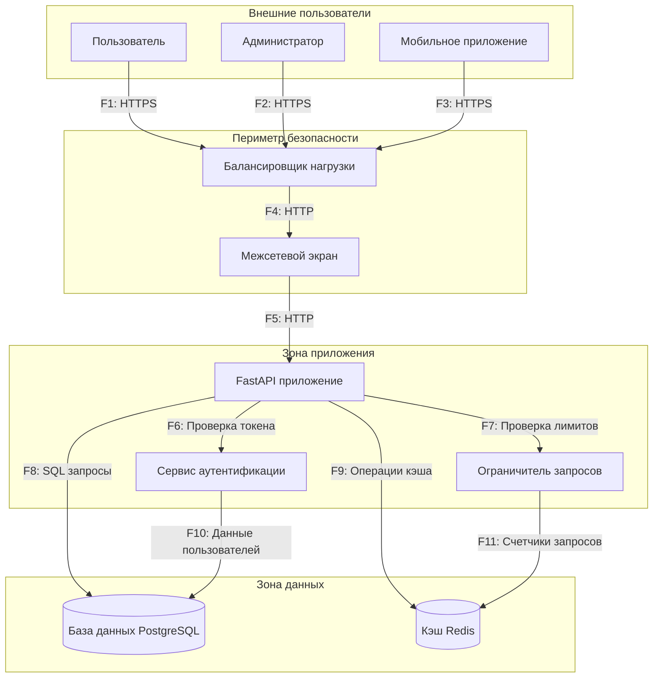

# Диаграмма потоков данных (DFD) - Система бронирования парковочных мест

## Описание потоков данных
| ID потока | Описание | Протокол | Данные |
|-----------|----------|----------|--------|
| F1 | Браузер пользователя к балансировщику | HTTPS | HTTP запросы |
| F2 | Администратор к балансировщику | HTTPS | Администрирование |
| F3 | Мобильное приложение к балансировщику | HTTPS | API вызовы |
| F4 | Балансировка трафика | HTTP | Трафик приложения |
| F5 | Отфильтрованный трафик к приложению | HTTP | Проверенные запросы |
| F6 | Проверка JWT токена | Внутренний | Верификация токена |
| F7 | Проверка ограничений запросов | Внутренний | Подсчет запросов |
| F8 | Операции с базой данных | SQL | Данные пользователей/слотов/бронирований |
| F9 | Операции с кэшем | Redis | Сессии/доступность |
| F10 | Данные аутентификации | SQL | Учетные данные |
| F11 | Данные ограничений | Redis | Счетчики запросов |
